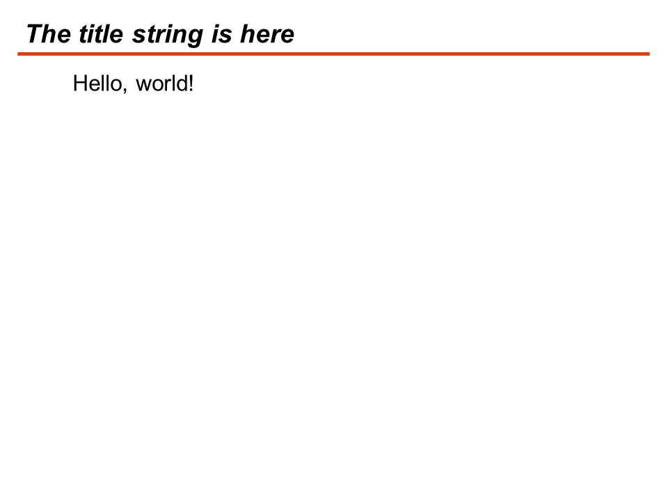
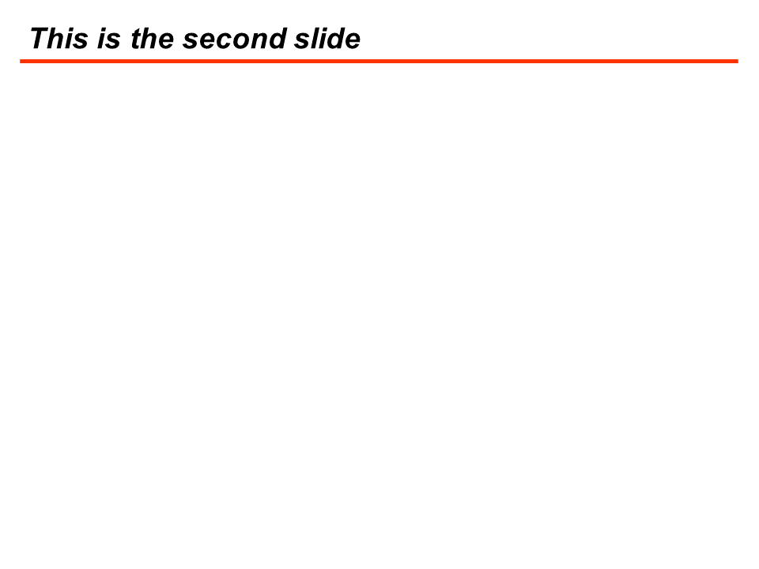
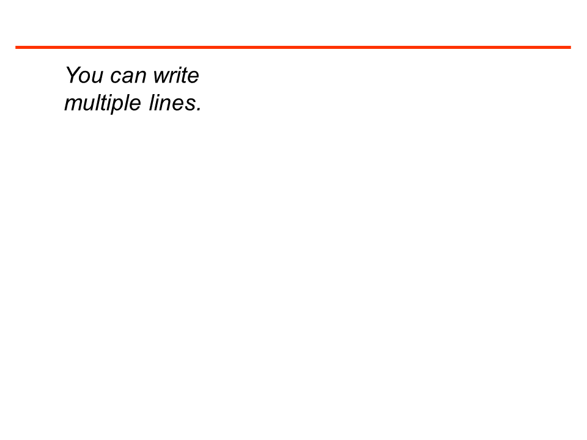
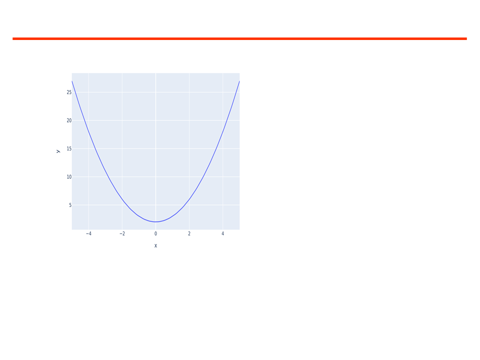
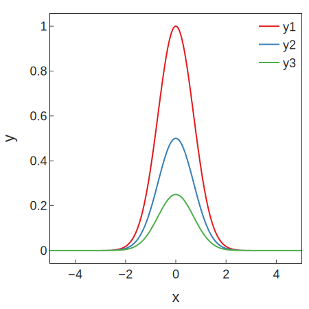
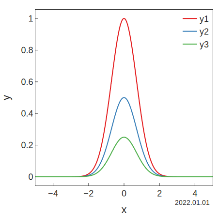
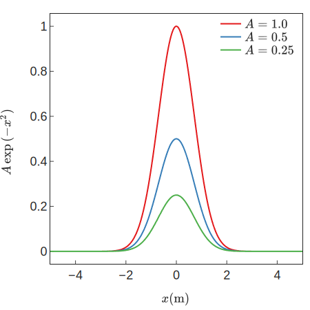
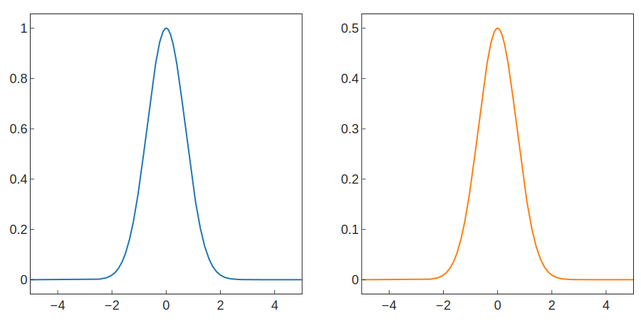
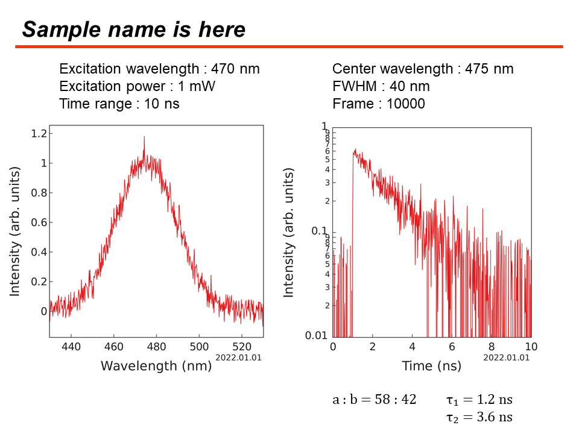

# Create PowerPoint files for Takeuchi Lab <!-- omit in toc -->

<p align="center">
<a href="https://github.com/wasedatakeuchilab/tlab-pptx/actions?query=workflow%3ATest" target="_blank">
    
</a>
<a href="https://codecov.io/gh/wasedatakeuchilab/tlab-pptx" target="_blank">
    
</a>
</p>

**_tlab-pptx_** is a Python package for creating PowerPoint(`.pptx`) files for Takeuchi laboratory.

- [Installation](#installation)
- [Getting Started](#getting-started)
  - [Create a PowerPoint](#create-a-powerpoint)
    - [Basic Usage](#basic-usage)
    - [Add a Slide](#add-a-slide)
    - [Add a Text](#add-a-text)
    - [Add a Figure](#add-a-figure)
  - [Create a Figure for PowerPoint](#create-a-figure-for-powerpoint)
    - [Basic Usage](#basic-usage-1)
    - [Date Annotation](#date-annotation)
    - [LaTeX for Text](#latex-for-text)
    - [Subplots](#subplots)
  - [Utilities](#utilities)
    - [Photo Luminescence Experiment](#photo-luminescence-experiment)
- [Lisence](#lisence)

## Installation

Python 3.10 or above is required.

```sh
$ pip install git+https://github.com/wasedatakeuchilab/tlab-pptx
```

## Getting Started

### Create a PowerPoint

#### Basic Usage

You can create a PowerPoint by calling `tlab_pptx.new_presentation()`.

```python
import tlab_pptx

prs = tlab_pptx.new_presentation()
slide = prs.slides[0]
slide.update_title(
    "The title string is here"
).add_text(
    "Hello, world!",
    left=2.5,
    top=2.5,
    font_size=24
)
prs.save("hello_world.pptx")
```



#### Add a Slide

You can add a slide to the presentation by calling `prs.add_slide()`.

```python
prs = tlab_pptx.new_presentation()
slide = prs.add_slide()
slide.update_title(
    "This is the second slide"
)
prs.save("add_slide.pptx")
```




#### Add a Text

You can add a text by calling `slide.add_text()`.

```python
prs = tlab_pptx.new_presentation()
prs.slides[0].add_text(
    "You can write\n"
    "multiple lines.",
    left=2.5,
    top=2.5,
    font_name="Arial",  # default font
    font_size=28,
    font_bold=False,
    font_italic=True
)
prs.save("add_text.pptx")
```



#### Add a Figure

You can add a [plotly](https://plotly.com/python/) figure by calling `slide.add_figure()`.

```python
import plotly.express as px
import numpy as np

x = np.linspace(-5, 5, 100)
y = x**2 + 2
fig = px.line(x=x, y=y)
prs = tlab_pptx.new_presentation()
prs.slides[0].add_figure(
    fig,
    left=2.5,
    top=2.5,
)
prs.save("add_figure.pptx")
```



### Create a Figure for PowerPoint

#### Basic Usage

You can get the default layout for PowerPoint by using `tlab_pptx.get_default_layout()`.

```python
import tlab_pptx
import plotly.express as px
import numpy as np

x = np.linspace(-5, 5, 1000)
y = np.exp(-(x**2))
fig = px.line(
    dict(x=x, y1=y, y2=0.5 * y, y3=0.25 * y),
    x="x",
    y=["y1", "y2", "y3"],
    color_discrete_sequence=px.colors.qualitative.Set1,
).update_layout(
    tlab_pptx.get_default_layout(),
    xaxis_title="x",
    yaxis_title="y",
)
fig.show()
```



#### Date Annotation

You can add a date annotation on the bottom-right of the figure by using `tlab_pptx.get_date_annotation()`.

```python
import datetime

fig.add_annotation(
    tlab_pptx.get_date_annotation(
        datetime.date(2022, 1, 1)
    )
)
fig.show()
```



#### LaTeX for Text

You can use LaTeX for texts on the figure.

```python
fig = px.line(
    {
        "x": x,
        "$A = 1.0$": y,
        "$A = 0.5$": 0.5 * y,
        "$A = 0.25$": 0.25 * y,
    },
    x="x",
    y=["$A = 1.0$", "$A = 0.5$", "$A = 0.25$"],
    color_discrete_sequence=px.colors.qualitative.Set1,
).update_layout(
    tlab_pptx.get_default_layout(),
    xaxis_title=r"$x \text{(m)}$",
    yaxis_title=r"$A \exp{(-x^2)} \text{(arb. units)}",
)
```



#### Subplots

Here is a subplots example.

```python
import plotly.subplots

layout = tlab_pptx.get_default_layout()
layout["width"] *= 2
fig = plotly.subplots.make_subplots(
    rows=1, cols=2
).add_scatter(
    x=x,
    y=y
    row=1, col=1
).add_scatter(
    x=x,
    y=0.5 * y,
    row=1, col=2
).update_layout(
    layout,
    showlegend=False
).update_xaxes(
    tlab_pptx.get_default_axis()
).update_yaxes(
    tlab_pptx.get_default_axis()
)
fig.show()
```



### Utilities

#### Photo Luminescence Experiment

You can create a PowerPoint with just one function `tlab_pptx.presentation.photo_luminescence.build()`.

```python
import datetime
import numpy as np
import plotly.express as px
import tlab_pptx

np.random.seed(100)
noise = np.random.normal(loc=1e-2, scale=5e-2, size=500)
# Create a fake H-figure
wavelength = np.linspace(430, 530, 500)
sigma = 20
center_wavelength = 475
h_fig = px.line(
    x=wavelength,
    y=np.exp(-((wavelength - center_wavelength) ** 2) / sigma**2) + noise,
    color_discrete_sequence=px.colors.qualitative.Set1,
).update_layout(
    xaxis_title="Wavelength (nm)",
    yaxis_title="Intensity (arb. units)",
)

# Create a fake V-figure
time_range = 10
time = np.linspace(0, time_range, 500)
tau = 2.0
v_fig = px.line(
    x=time,
    y=np.where(time < 1.0, 0, np.exp(-time / tau)) + noise,
    color_discrete_sequence=px.colors.qualitative.Set1,
    log_y=True,
    range_y=(1e-2, 1)
).update_layout(
    xaxis_title="Time (ns)",
    yaxis_title="Intensity (arb. units)",
)

# Create a PowerPoint
prs = tlab_pptx.presentation.photo_luminescence.build(
    title_text="Sample name is here",
    excitation_wavelength=470,
    excitation_power=1,
    time_range=time_range,
    center_wavelength=center_wavelength,
    FWHM=2 * sigma,
    frame=10000,
    date=datetime.date(2022, 1, 1),
    h_fig=h_fig,
    v_fig=v_fig,
    a=0.63,
    b=0.44,
    tau1=1.2,
    tau2=3.6,
)
prs.save("photo_luminescence.pptx")
```



## Lisence

[MIT License](./LICENSE)

Copyright (c) 2022 Shuhei Nitta
